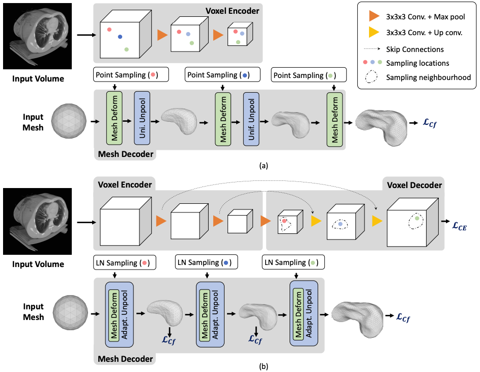
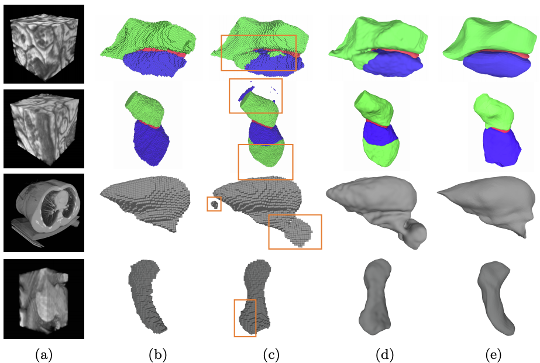

# Voxel2Mesh: 3D Mesh Model Generation from Volumetric Data

This repository is a PyTorch implementation of Voxel2Mesh architecture proposed in *Voxel2Mesh: 3D Mesh Model Generation from Volumetric Data*; Udaranga Wickramasinghe, Edoardo Remelli, Graham Knott and Pascal Fua; MICCAI 2020. 

## Abstract

CNN-based volumetric methods that label individual voxels now dominate the field of biomedical segmentation. However, 3D surface representations are often required for proper analysis. They can be obtained by post-processing the labeled volumes which typically introduces artifacts and prevents end-to-end training. In this paper, we therefore introduce a novel architecture that goes directly from 3D image volumes to 3D surfaces without post-processing and with better accuracy than current methods. We evaluate it on Electron Microscopy and MRI brain images as well as CT liver scans. We will show that it outperforms state-of-the-art segmentation methods.

## Architecture
  

<p class="aligncenter">
    
</p>
Fig. 1. Architectures (a) The Pixel2Mesh-3D architecture, a straightforward extension of [20], uses a surface decoder but no voxel decoder. (b) By contrast, our
Voxel2Mesh architecture takes as input an image and spherical mesh. They are jointly
encoded and then decoded into cubes and meshes of increasing resolution. At each mesh
decoding stage, the decoder first receives as input the current mesh and a set of features sampled from the cube of corresponding resolution. Then the mesh is deformed
and refined non-uniformly by adding vertices only where they are needed.
 


Fig. 2. Qualitative results. (a) Input volumes. EM (row 1,2), CT(row 3), MRI(row
4) (b) Ground truth (c) CNN baseline (d) CNN baseline + post processing (e)
Voxel2Mesh. The orange boxes highlight false positive regions.


## Installation
PyTorch 1.4

Python 3.6.9

Update: You can use the enviroment.yaml file created by ctr26 to find the necessary packages. 

## Dataset

&emsp;1. [CHAOS dataset](https://chaos.grand-challenge.org/Download/)  . 

&emsp;2. [Hippocampus dataset](https://drive.google.com/file/d/1RzPB1_bqzQhlWvU-YGvZzhx2omcDh38C/view?usp=sharing). Missing `dataset_init` function to generate .npy files: https://github.com/cvlab-epfl/voxel2mesh/issues/7

&emsp;3. [Synaptic junction dataset](https://drive.google.com/drive/folders/1CVPLnfOdt_3x0bioFWva4VENk2bjgbri?usp=sharing).

## Running Experiments

&emsp; Step 1: Update config.py. You need to set the path to the dataset and also the directory to save the results.

&emsp; Step 2: If it is the first time, you need to pre-process the data. For that execute ```python data_preprocess.py```. Pre-processed data will be save at the dataset directory.

&emsp; Step 3: Now execute ```python main.py``` and this will start training the network. 

## Known Issues

#### GPU memory limitations
For our experiments, we used a GPU with 32GB of memory. If you are using a GPU with memory less than 20GB, you might run out of GPU memory during evaluation stage since we use higher number of vertices at this stage. To reduce the number of vertices during evaluation stage, you can reduce the number of mesh unpoolings (sub-divisions) specified at line 128 in data.py. For instance you can change ```'unpool':[0, 1, 1, 1, 1]``` to ```'unpool':[0, 1, 0, 1, 1]``` or ```'unpool':[0, 1, 0, 1, 0]```

#### Order of slices in loaded image stacks
In some systems, order of the slices in the loaded image stack can be shuffled. This issue was first reported by Patrick Jenson and he proposed a solution [here](https://github.com/cvlab-epfl/voxel2mesh/issues/3) 

#### Missing faces on output mesh
This happens due to the vertex order in the face matrix. In the meshes produced by Voxel2Mesh, some faces have vertices in clockwise direction and others have them in anti-clockwise direciton. This could be easily fixed by setting the 'back-face' color of the faces in your mesh viewer same as the 'front-face' color OR by writing a function to correct the orientations of the faces. 

## Citation
If you find Voxel2Mesh useful, please cite the [MICCAI article](https://link.springer.com/chapter/10.1007/978-3-030-59719-1_30)
```
@InProceedings{10.1007/978-3-030-59719-1_30,
author="Wickramasinghe, Udaranga and Remelli, Edoardo and Knott, Graham and Fua, Pascal",
title="Voxel2Mesh: 3D Mesh Model Generation from Volumetric Data",
booktitle="Medical Image Computing and Computer Assisted Intervention -- MICCAI 2020",
year="2020",
publisher="Springer International Publishing",
address="Cham",
pages="299--308", 
isbn="978-3-030-59719-1"
}
```

## Contact
For any questions regard this paper/code, please make a post in Issues.

